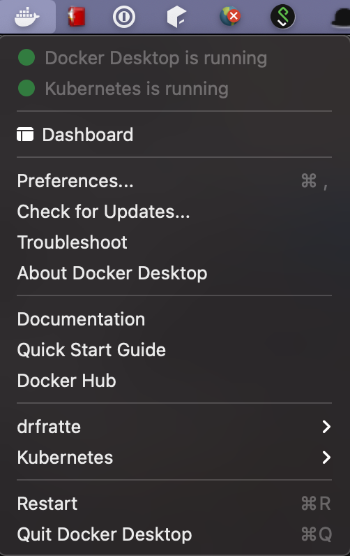
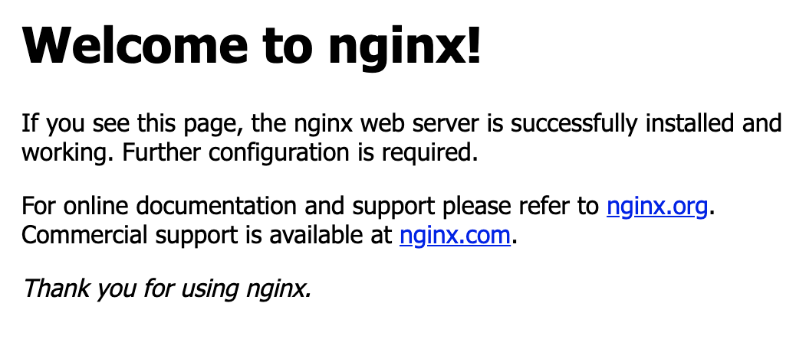
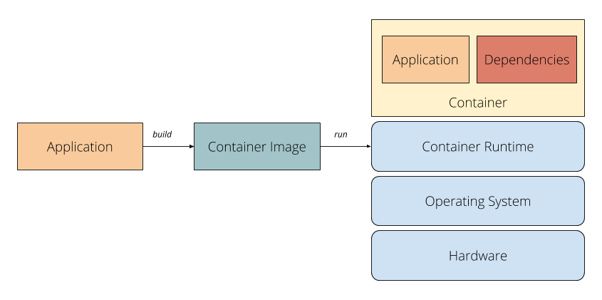
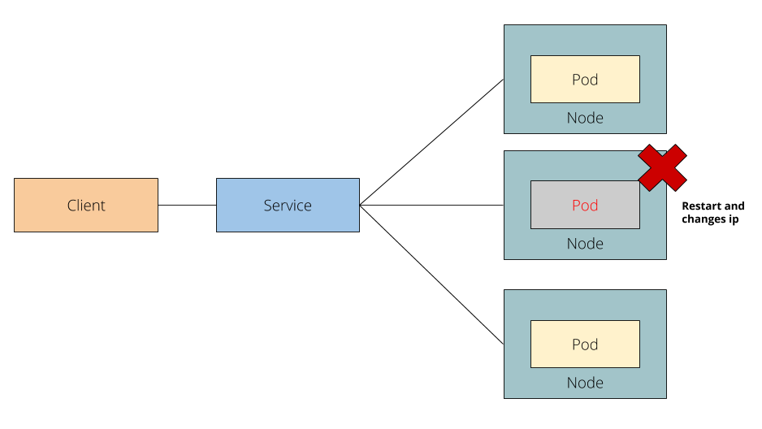

# Kubernetes 101

Kubernetes 101 is a beginner-friendly tutorial designed for those with no prior knowledge or experience with Kubernetes.

## Goal

Establish a foundational understanding of Kubernetes, combining theoretical knowledge with hands-on experience.

## Prerequisites

Basic familiarity with Linux commands is required. Additionally, a general understanding of containers, microservices architecture, and distributed systems is recommended.

## Installation

Set up the following tools:

- **Docker Desktop** – Follow [these instructions](https://docs.docker.com/docker-for-mac/install/)
- **Bash or Zsh**
- **A code editor** – Visual Studio Code, Vim, or a similar editor

## Step by step

### Verifying Setup

Let's begin by ensuring that Docker and Kubernetes are correctly installed on your system:

1. Open your terminal.
2. Verify that **Docker Desktop** is running.

   

3. Check the Docker version:
   ```sh
   docker --version
   ```
   Expected output (version may vary):
   ```
   Docker version 20.10.7, build f0df350
   ```
4. Check the Kubernetes version:
   ```sh
   kubectl version --short
   ```
   Expected output:
   ```
   Client Version: v1.21.2
   Server Version: v1.19.7
   ```

---

### Working with Containers

Containers package applications and their dependencies in a standardized way. Let's run a simple **Nginx** server using Docker.

1. Pull the Nginx image:
   ```sh
   docker pull nginx:latest
   ```
2. Run the container:
   ```sh
   docker run --name nginx-server -d -p 8080:80 nginx
   ```
   Expected output: a long container ID.
3. Check if the container is running:
   ```sh
   docker ps | grep nginx-server
   ```
   Example output:
   ```
   c838b80e0ea2   nginx   "/docker-entrypoint.…"   Up 6 seconds   0.0.0.0:8080->80/tcp   nginx-server
   ```
4. Open a browser and go to `localhost:8080`, or run:
   ```sh
   curl localhost:8080
   ```
   You should see the Nginx default page.

   

   By following these steps we have started a container from an image that fires up an nginx server.

   
   
5. Stop the container before moving to the next section:
   ```sh
   docker kill <CONTAINER_ID>
   ```

---

### Pods: The Basic Unit in Kubernetes

A **Pod** is the smallest deployable unit in Kubernetes, consisting of one or more containers that share networking and storage.

Here’s how we define a Pod to run Nginx:

```yaml
apiVersion: v1
kind: Pod
metadata:
  name: nginx-pod
spec:
  containers:
    - name: nginx
      image: nginx:latest
      ports:
      - containerPort: 80
```

Apply the configuration and verify the Pod:
```sh
kubectl apply -f pod.yaml
kubectl get pods
kubectl port-forward pod/nginx-pod 8080:80
```

Now, access `localhost:8080` to confirm that Nginx is running inside the Pod.

To inspect the Pod details:
```sh
kubectl describe pod nginx-pod
```

---

### Deployments: Managing Application Scaling

A **Deployment** ensures that the desired number of **replica Pods** are running. It manages rolling updates and rollbacks.


Deployment YAML:
```yaml
apiVersion: apps/v1
kind: Deployment
metadata:
  name: nginx-deployment
spec:
  replicas: 1
  selector:
    matchLabels:
      app: nginx
  template:
    metadata:
      labels:
        app: nginx
    spec:
      containers:
      - name: nginx
        image: nginx:latest
        ports:
        - containerPort: 80
```

Apply and verify:
```sh
kubectl apply -f deployment.yaml
kubectl get deployments
kubectl get pods
```

To scale the deployment to **3 replicas**:
```sh
kubectl scale deployment nginx-deployment --replicas=3
kubectl get pods
```

To scale back to **2 replicas**:
```sh
kubectl scale deployment nginx-deployment --replicas=2
```

---

### Services: Enabling Communication Between Pods

Pods have dynamic IP addresses, so Kubernetes provides **Services** to expose applications and provide a stable endpoint.



Service YAML:
```yaml
apiVersion: v1
kind: Service
metadata:
  name: my-nginx-service
spec:
  selector:
    app: nginx
  ports:
    - protocol: TCP
      port: 80
```

Expose a deployment using a Service:
```sh
kubectl expose deployment nginx-deployment --type=LoadBalancer
kubectl get services
```

Expected output:
```sh
service "nginx-deployment" exposed
```

---

### Contribute

Contributions are welcome in the form of feedback, opening GitHub issues, or submitting pull requests.

### Author

Done with 💚 by [Daniel Fratte](https://www.linkedin.com/in/drfratte/)